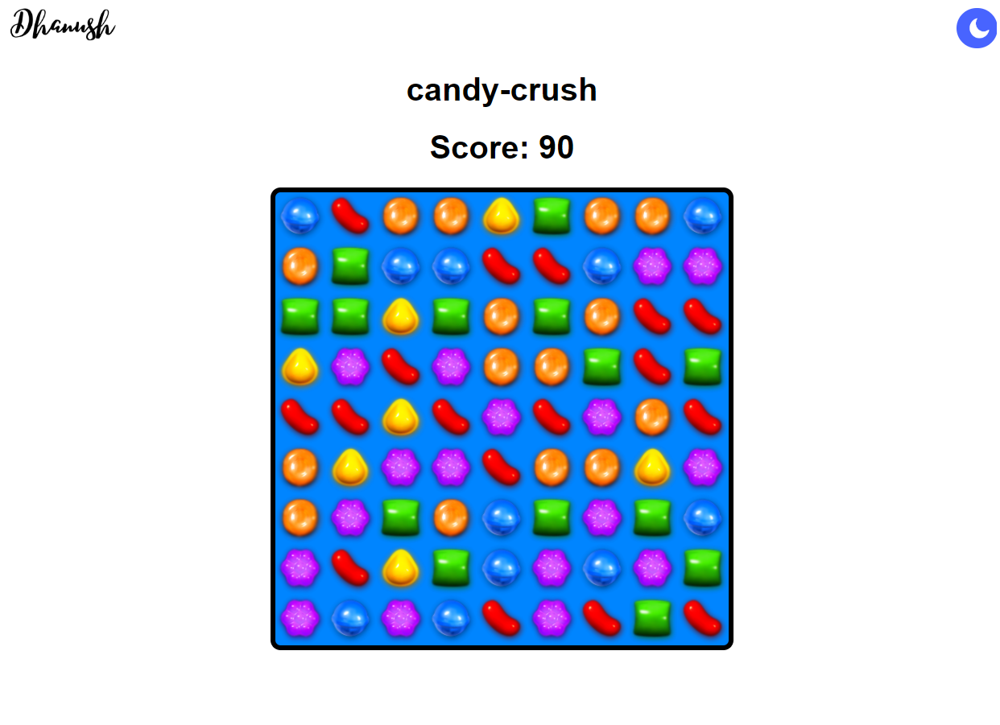
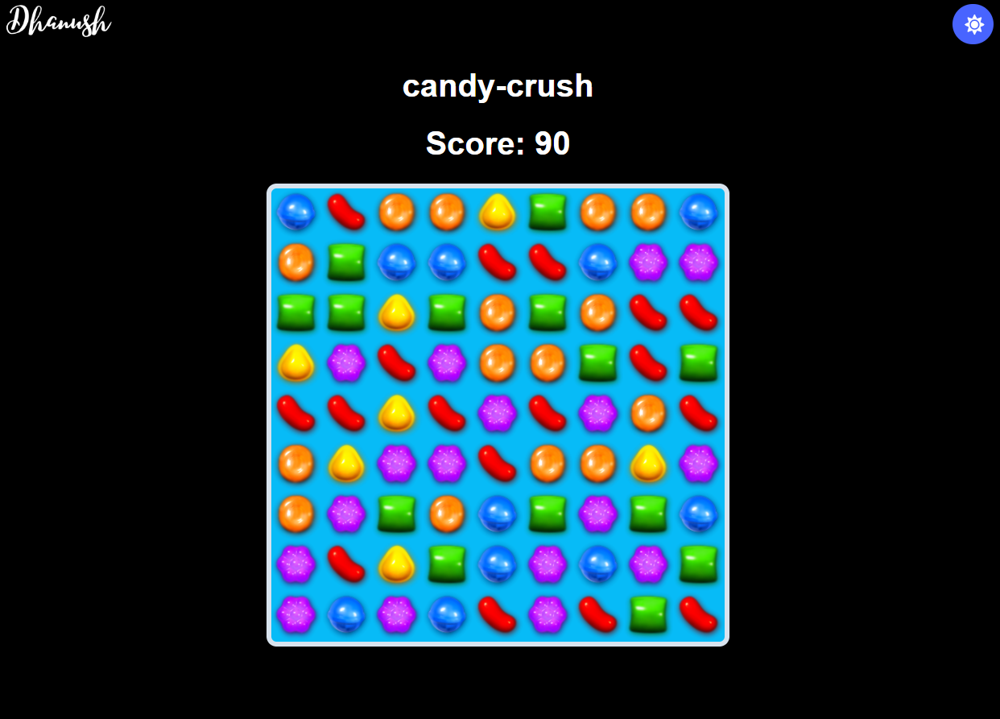

# Candy-Crush
### I developed that basic candy-crush game using JavaScript, HTML, and CSS. By doing that I was able to get a good understanding of how javascript functions work.

### Light Mode

### Dark mode

